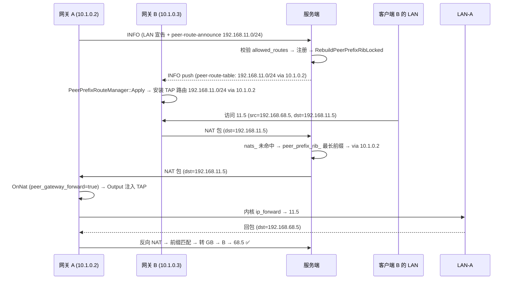

# Peer 前缀路由（Site-to-Site 真实子网互访）设计方案

> **目标**：借鉴 Miaocchi 分叉的完整实现，为主仓库（picetor/openppp2）设计 peer 模式，
> 实现**不同客户端之间真实子网（LAN）的互访**——例如客户端 A 的 `192.168.11.0/24`
> 与客户端 B 的 `192.168.68.0/24` 通过 VPN 双向可达，无需 NAT 或中心路由。
>
> **现状对比**：
> - Miaocchi 分叉：**已完整实现**（客户端路由安装 + 服务端前缀中继 + 网关宣告）。
> - 主仓库 picetor 版：`client.routing.peer_routes` 仅有配置解析（`AppConfiguration.cpp`），
>   **无运行时消费方**；服务端无任何 peer 前缀代码。需要移植。

---

## 1. 目标场景与设计目标

### 1.1 目标场景

```
                    ┌────────────── VPN 虚拟子网 10.1.0.0/24 ──────────────┐
                    │                                                     │
   ┌───────────┐    │   ┌──────────────────┐        ┌──────────────────┐  │    ┌───────────┐
   │  LAN-A    │    │   │  客户端 A (网关)  │        │  客户端 B (网关)  │  │    │  LAN-B     │
   │192.168.11.0/24 │  │  TAP 10.1.0.2    │        │  TAP 10.1.0.3    │  │    │192.168.68.0/24 │
   │ 11.5      │◄───►│  vmbr0 192.168.11.2│◄──────►│  vmbr0 192.168.68.2│◄───►│ 68.5      │
   └───────────┘    │   └──────────────────┘        └──────────────────┘  │    └───────────┘
                    │              ▲                        ▲              │
                    └──────────────┼────────────────────────┼──────────────┘
                                   │  前缀路由表              │
                                   ▼                        ▼
                          ┌────────────────────────────────────┐
                          │             服务端 (中继)          │
                          │   peer_prefix_rib_:                │
                          │   192.168.11.0/24 → 10.1.0.2       │
                          │   192.168.68.0/24 → 10.1.0.3       │
                          └────────────────────────────────────┘
```

### 1.2 设计目标

| 能力 | 说明 |
|------|------|
| **双向子网互访** | A 的 LAN 设备访问 B 的 LAN 设备（如 `11.5 → 68.5`），反向亦然 |
| **零 NAT 依赖** | 网关宿主机只需 `ip_forward=1` + 自身路由，不需要额外 SNAT（除非地址重叠） |
| **静态 + 动态** | 运维可静态写死前缀路由；网关上线后也可由服务端动态下发 |
| **向后兼容** | `peer-routing.enabled=false` 时行为与现在完全一致 |

### 1.3 非目标

- ❌ 不支持 IPv6 前缀网关路由（仅 IPv4，与 Miaocchi 一致）
- ❌ 网关 peer 不替宿主机做 SNAT（需宿主机 `ip_forward` + 自有路由）
- ❌ Android/iOS 的 OS 路由安装能力有限，仅桌面 Linux/Windows/macOS 完整支持

---

## 2. 架构设计（三层分工）

### 2.1 三层职责

```
┌─────────────────────────────────────────────────────────────┐
│ 客户端路由层 (访问方)                                        │
│   · 在 TAP 上安装 "192.168.68.0/24 via 10.1.0.3"             │
│   · OS 路由表把流量送进 TAP → 客户端封装 NAT 包 → 服务端     │
├─────────────────────────────────────────────────────────────┤
│ 服务端中继层 (枢纽)                                          │
│   · 维护 peer_prefix_rib_ (前缀 → 网关虚拟IP)                │
│   · 收包先精确查 nats_，未命中再最长前缀查 peer_prefix_rib_   │
│   · 命中后转给网关 peer 的 exchanger                         │
├─────────────────────────────────────────────────────────────┤
│ 网关宿主机层 (出口)                                          │
│   · 收到 NAT 包 → OnNat() → Output() 注入 TAP                │
│   · 内核按真实路由表转发到物理 LAN (需 ip_forward=1)         │
└─────────────────────────────────────────────────────────────┘
```

### 2.2 与现有机制的关系

```
Phase 0 虚拟子网 (nats_ 精确匹配)   ← 已有
        │
        ▼
Peer 前缀路由 (本设计)              ← 新增，插入 nats_ 与丢弃之间
        │
        ├── 静态 client.routing.ip.peer-routes
        ├── 动态 server.peer-routing.distribute
        └── 网关 client.peer-route-announce + client.peer-gateway-forward
```

**关键不变式**：peer 前缀转发是 `nats_` 精确匹配的**补充**，优先级低于精确匹配。
普通虚拟子网互访（`10.1.0.2 ↔ 10.1.0.3`）完全不受影响。

---

## 3. 数据面设计

### 3.1 出站（客户端 B 的 LAN → 客户端 A 的 LAN）

以 `68.5 (LAN-B) → 11.5 (LAN-A)` 为例：

```
1. 68.5 发包到 11.5，默认网关指向 B (192.168.68.2)
2. B 的 ip_forward 接收，查路由: 11.5 不在本地 → 查 TAP 路由
3. B 的路由表: 192.168.11.0/24 via 10.1.0.2 dev tap0   ← PeerPrefixRouteManager 安装
4. 包 (src=192.168.68.5? 或 src=10.1.0.3) 进 TAP
```

> **地址处理有两种模式**（二选一，设计为可配置）：
> - **模式 1（无 SNAT）**：B 需把 `192.168.11.0/24` 加进真实路由指向 TAP，
>   包 src 保持 `192.168.68.5`。回程需 A 侧路由 `192.168.68.0/24 via TAP` 对称。
>   这是标准 site-to-site，两侧路由对称，**推荐**。
> - **模式 2（B 做 SNAT）**：B 对发往 `192.168.11.0/24` 的包做 MASQUERADE，
>   src 变成 B 的 TAP IP `10.1.0.3`。回程只需 A 把 `10.1.0.0/24` 指回 TAP，
>   B 侧不用回程路由。**A 的 LAN 设备看到的源是 10.1.0.3**。

### 3.2 服务端转发决策（核心）

```cpp
// VirtualEthernetExchanger.cpp forward lambda（Miaocchi L2390-2468）
static const auto forward = [](VirtualEthernetSwitcher* switcher, uint32_t source,
    uint32_t destination, Byte* packet, int packet_length, YieldContext& y) noexcept -> int {

    bool via_gateway = false;
    VES::NatInformationPtr nat = switcher->FindNatInformation(destination);
    // ① 精确匹配 nats_ 未命中 → ② 最长前缀匹配 peer_prefix_rib_
    if (NULLPTR == nat && switcher->IsPeerRoutingEnabled()) {
        uint32_t via = switcher->FindGatewayVirtualIPForDestination(destination);
        if (via != 0) {
            nat = switcher->FindNatInformation(via);   // 网关虚拟IP必须也在 nats_
            via_gateway = (NULLPTR != nat);
        }
    }
    if (NULLPTR == nat) {
        return 0;   // ③ 均未命中 → 丢弃（维持现状）
    }

    // 前缀转发时跳过网关 peer 自身子网掩码校验（dst 不在网关 TAP 子网内）
    if (!via_gateway) {
        uint32_t mask = nat->SubmaskAddress;
        if ((destination & mask) != (nat->IPAddress & mask)) {
            return 0;
        }
    }

    std::shared_ptr<VirtualEthernetExchanger>& exchanger = nat->Exchanger;
    ITransmissionPtr transmission = exchanger->GetTransmission();
    if (NULLPTR != transmission) {
        if (exchanger->DoNat(transmission, packet, packet_length, y)) {
            return 1;
        }
        transmission->Dispose();
    }
    return -1;
};
```

**优先级**：
```
1. nats_[dst] 精确匹配        → 转给 owner peer（原有逻辑）
2. peer_prefix_rib_ 最长前缀  → 转给 gateway peer 虚拟 IP
3. 均未命中                   → 丢弃
```

### 3.3 入站（网关 A 收到 11.5 的包）

网关 A 的 `VEthernetExchanger::OnNat()` 收到服务端转来的包：

```cpp
// Miaocchi VEthernetExchanger.cpp L2703-2767
bool VEthernetExchanger::OnNat(...) {
    // peer_gateway_forward=false（默认）时只接受 dst == 自己 TAP IP 的包
    if (NULLPTR != configuration && !configuration->client.peer_gateway_forward) {
        bool destination_matches = ... ip->dest == tap->IPAddress;
        if (!destination_matches) {
            return false;   // ← 拒绝转发给其他地址的包
        }
    }
    // peer_gateway_forward=true 时放行所有包 → 注入 TAP
    return switcher_->Output(packet, packet_length);
}
```

**网关必须配 `client.peer-gateway-forward = true`**，否则非本机 TAP IP 的包会被拒绝。

### 3.4 服务端数据结构

```cpp
// VirtualEthernetSwitcher 新增成员
typedef struct PeerPrefixGatewayRecord {
    Int128                                   SessionId;
    uint32_t                                 VirtualIP;    // 网关 peer 虚拟 IP (主机序)
    std::shared_ptr<VirtualEthernetExchanger> Exchanger;
    ppp::vector<PeerPrefixRouteEntry>         Prefixes;     // 宣告的前缀列表
} PeerPrefixGatewayRecord;

ppp::unordered_map<Int128, PeerPrefixGatewayRecord> peer_prefix_gateways_; // session → 宣告
ForwardInformationTable                           peer_prefix_rib_;        // 前缀 → via
```

---

## 4. 控制面设计

### 4.1 INFO 扩展 JSON（复用现有 VirtualEthernetInformationExtensions 信封）

主仓库已有 `VirtualEthernetInformationExtensions`（IPv6/client-ipv4），
**新增两个子结构**（对齐 Miaocchi）：

#### 4.1.1 `peer-route-announce`（客户端 → 服务端）

网关 peer 连接时宣告可达前缀：

```json
{
  "peer-route-announce": {
    "enabled": true,
    "action": "register",
    "prefixes": [
      { "network": "192.168.11.0", "prefix": 24 }
    ]
  }
}
```

#### 4.1.2 `peer-route-table`（服务端 → 客户端）

路由快照，客户端据此安装 OS/TAP 路由：

```json
{
  "peer-route-table": {
    "enabled": true,
    "action": "snapshot",
    "routes": [
      { "network": "192.168.11.0", "prefix": 24, "via": "10.1.0.2" },
      { "network": "192.168.68.0", "prefix": 24, "via": "10.1.0.3" }
    ]
  }
}
```

### 4.2 握手时序



---

## 5. 配置参考

### 5.1 服务端

```json
{
  "server": {
    "subnet": true,
    "ipv4-pool": { "network": "10.1.0.0", "mask": "255.255.255.0" },
    "peer-routing": {
      "enabled": true,
      "distribute": true,
      "allowed-routes": [
        { "network": "192.168.11.0", "prefix": 24, "guid": "{GATEWAY-A-GUID}" },
        { "network": "192.168.68.0", "prefix": 24, "guid": "{GATEWAY-B-GUID}" }
      ]
    }
  }
}
```

| 键 | 类型 | 默认 | 说明 |
|----|------|------|------|
| `server.subnet` | bool | `true` | **必须 true**，否则前缀路由不工作 |
| `server.peer-routing.enabled` | bool | `false` | 启用服务端前缀表与转发 |
| `server.peer-routing.distribute` | bool | `true` | 前缀变化时向所有客户端推送快照 |
| `server.peer-routing.allowed-routes` | array | `[]` | 白名单：哪个 GUID 可宣告哪个前缀 |

### 5.2 客户端 — 网关（宣告前缀 + 放行转发）

```json
{
  "client": {
    "guid": "{GATEWAY-A-GUID}",
    "server": "ppp://vpn.example.com:68000/",
    "peer-route-announce": [
      { "network": "192.168.11.0", "prefix": 24 }
    ],
    "peer-gateway-forward": true,
    "tun": {
      "ip": "10.1.0.2",
      "gw": "10.1.0.1",
      "mask": "255.255.255.0"
    }
  }
}
```

网关宿主机额外配置（Linux）：

```bash
sysctl -w net.ipv4.ip_forward=1
# 模式 1 (无 SNAT, 对称路由): 加回程路由
ip route add 192.168.68.0/24 via 10.1.0.3 dev tap0
# 模式 2 (SNAT): 无需回程路由
iptables -t nat -A POSTROUTING -d 192.168.68.0/24 -j MASQUERADE
```

### 5.3 客户端 — 访问方（静态路由，可选）

```json
{
  "client": {
    "guid": "{CLIENT-B-GUID}",
    "server": "ppp://vpn.example.com:68000/",
    "routing": {
      "ip": {
        "peer-routes": [
          { "network": "192.168.11.0", "prefix": 24, "via": "10.1.0.2" }
        ]
      }
    }
  }
}
```

若服务端 `distribute=true`，访问方**无需**静态配置，动态快照自动生效。

### 5.4 配置陷阱（代码验证结论）

> 以下规则均来自 Miaocchi 源码逐行验证（2026-08-02），移植时必须遵守：

| # | 陷阱 | 结论 | 代码依据 |
|----|------|------|---------|
| 1 | **CIDR 斜杠写法** `"network": "192.168.11.0/24"` | ❌ **不支持**。`network` 必须纯 IP，`prefix` 独立字段 | `ReadJsonToPeerPrefixRoute`（AppConfiguration.cpp）读 `prefix` 缺省=0 → 校验失败丢弃；`ParsePeerPrefixNetwork`（PeerRouteAnnouncePolicy.h）用 `make_address` 解析，带 `/` 直接失败 → 宣告 reject |
| 2 | **`peer-routes[].via` 可省** | ❌ **必填**。`install_route` 第一步 `if (!route.HasVia()) return false` → 静默丢弃 | PeerPrefixRouteManager.cpp L68-69 |
| 3 | **`peer-routes[].via` 指向自己 TAP IP** | ❌ 拒绝安装 | `if (via == tap->IPAddress) return false`（PeerPrefixRouteManager.cpp L82-84） |
| 4 | **`allowed-routes` 可省略**（文档最小样例如此） | ❌ **fail-closed**：空白名单拒绝**一切**宣告 → 网关宣告全被 reject（telemetry: `server.peer_route.announce_rejected`） | `IsPeerRouteAnnouncementAllowed`（PeerRouteAnnouncePolicy.h L113）：循环无一匹配 → `return false` |
| 5 | **`server.ipv4-pool` 用 `prefix` 数字** | ❌ 只认 `network` + `mask` 字符串。`mask` 必须点分十进制（`"255.255.255.0"`），`StringToAddress` 解析失败则 IPv4 池不生效 | AppConfiguration.cpp L1925-1929 + VirtualEthernetSwitcher.cpp L2828-2833 |
| 6 | **`peer-route-announce[].via`** | ❌ **禁止写**。宣告只写 `network` + `prefix`，服务端自动用宣告方虚拟 IP 填充 via | `BindPeerRouteGateway`（PeerRouteAnnouncePolicy.h L31-37） |
| 7 | **`server.subnet=false` 时开 peer-routing** | ❌ 不工作。`IsPeerRoutingEnabled()` 要求 `subnet && peer_routing.enabled` 同时成立 | VirtualEthernetSwitcher.cpp L5281-5285 |
| 8 | **网关未完成 LAN 宣告就发 announce** | ❌ reject。服务端先从 `nats_` 反查宣告方虚拟 IP，未注册（`virtual_ip == 0`）→ reject | VirtualEthernetSwitcher.cpp L5380-5391 |

### 5.5 via 的语义：下一跳 ≠ 本机 tun-ip

**核心记忆点：`via` 永远指向对端网关的虚拟 IP，永远不等于自己的 `--tun-ip`。**

| 字段 | 问的问题 | 填什么 | 例子 |
|------|---------|--------|------|
| `network` + `prefix` | 去哪（目标网段） | 对方 LAN 前缀 | `192.168.68.0/24` |
| `via` | 交给谁（下一跳设备） | 对端网关的**虚拟 IP** | `192.168.12.68` |
| `--tun-ip` | 我是谁（本机虚拟 IP） | 自己的 TAP 地址 | `192.168.12.2` |

**典型错误**：在 Windows（`--tun-ip=192.168.12.68`）上写 `{ "network": "192.168.68.0", "prefix": 24, "via": "192.168.12.68" }`：
1. 语义错——`192.168.68.0/24` 是 Windows **自己的 LAN**，本机直连，不该进隧道；
2. 代码拒——`via == tap->IPAddress` → `install_route` 拒绝安装。

### 5.6 三端 via 来源表

| 端 | via 从哪来 | 说明 |
|----|-----------|------|
| **访问方**（静态 `peer-routes`） | **手写** | 必须写，指向对端网关虚拟 IP |
| **服务端** | **自动推导** | 宣告方的虚拟 IP（`nats_` 反查），配置里不出现 via |
| **网关**（`peer-route-announce`） | **不写** | 宣告只写 network+prefix，禁止写 via |

### 5.7 信任边界：服务端用 GUID，客户端用 IP

| | 服务端白名单 | 客户端 peer-routes |
|--|------------|-------------------|
| 谁在管？ | 服务端（裁判） | 本机管理员（自己配自己） |
| 防谁？ | 冒牌网关宣告别人前缀 | 防自己写错（无恶意威胁） |
| 用什么标识？ | **GUID**（身份，握手认证绑定） | **IP**（下一跳地址，路由表只认 IP） |
| 输入可信度 | 网络宣告报文（**不可信**） | 本地 JSON 配置（**可信**） |

**为什么服务端不能用虚拟 IP 当白名单 key**：虚拟 IP 是客户端通过 `PacketAction_LAN` 宣告的，服务器只查重不验所有权，任何设备都能声称自己是 `192.168.12.2`。GUID 由握手私钥认证绑定（`AuthenticatePlainTransport`），无法伪造。**虚拟 IP 是白名单通过的"奖励"，不是白名单的"凭证"。**

### 5.8 双向互通完整示例（pve ↔ Windows，真实拓扑）

```
192.168.11.0/24 (pve LAN)          VPN 隧道         192.168.68.0/24 (本机 LAN)
┌──────────────┐    ┌──────────────┐    ┌──────┐    ┌──────────────┐    ┌──────────────┐
│ 11.5         │    │ pve 网关      │    │ 服务端 │    │ Windows 网关  │    │ 68.5         │
│ 默认网关 11.2 │◄──►│ TAP 192.168.12.2│◄──►│      │◄──►│ TAP 192.168.12.68│◄──►│ 默认网关 68.1 │
└──────────────┘    └──────────────┘    └──────┘    └──────────────┘    └──────────────┘
  宣告 192.168.11.0/24                          ← RIB →                  宣告 192.168.68.0/24
```

**服务端**（白名单必须配，缺一不可）：

```json
{
  "server": {
    "subnet": true,
    "ipv4-pool": { "network": "192.168.12.0", "mask": "255.255.255.0" },
    "peer-routing": {
      "enabled": true,
      "distribute": true,
      "allowed-routes": [
        { "network": "192.168.11.0", "prefix": 24, "guid": "{PVE-GUID}" },
        { "network": "192.168.68.0", "prefix": 24, "guid": "{WIN-GUID}" }
      ]
    }
  }
}
```

**pve 网关**（宣告自己 LAN + 放行转发）：

```json
{
  "client": {
    "guid": "{PVE-GUID}",
    "peer-route-announce": [ { "network": "192.168.11.0", "prefix": 24 } ],
    "peer-gateway-forward": true
  }
}
```

**Windows 网关**（对称）：

```json
{
  "client": {
    "guid": "{WIN-GUID}",
    "peer-route-announce": [ { "network": "192.168.68.0", "prefix": 24 } ],
    "peer-gateway-forward": true
  }
}
```

两端**均无需静态 `peer-routes`**（distribute 自动装对方前缀路由）；若要静态双保险可加（`via` 指向对端虚拟 IP）：

```json
// pve 上加：
"routing": { "ip": { "peer-routes": [ { "network": "192.168.68.0", "prefix": 24, "via": "192.168.12.68" } ] } }
// Windows 上加：
"routing": { "ip": { "peer-routes": [ { "network": "192.168.11.0", "prefix": 24, "via": "192.168.12.2" } ] } }
```

**Windows 系统层额外三步**（Windows 默认不开转发、防火墙拦转发）：

```powershell
# ① 开启 IPv4 转发（管理员 PowerShell）
netsh interface ipv4 set global forwarding=enabled
# ② 防火墙放行 tap 接口转发
New-NetFirewallRule -DisplayName "PPP LAN route forward" -Direction Inbound -Action Allow -InterfaceAlias "ppp" -Protocol Any
# ③ 确认 tap 网卡允许共享（网络连接属性）
```

**数据流（11.5 → 68.5）**：`11.5 → pve(ip_forward) → TAP → 服务端(RIB: 68.0/24→12.68) → Windows(OnNat+ip_forward) → 68.5`，回程对称。

---

## 6. 主仓库移植清单（改动点）

> 以下改动点均以 Miaocchi 对应实现为参照，逐文件列出。
> **建议**：直接从 Miaocchi 分叉 cherry-pick 对应文件，再适配 picetor 的差异。

### 6.1 新增文件

| 文件 | 内容 | Miaocchi 参照 |
|------|------|---------------|
| `ppp/app/protocol/PeerPrefixRoute.h` | `PeerPrefixRouteEntry` 结构 + JSON 序列化 | 原样移植 |
| `ppp/app/client/PeerPrefixRouteManager.h/cpp` | 客户端路由安装/清除 | 原样移植 |
| `ppp/app/server/PeerRouteAnnouncePolicy.h` | 宣告白名单校验 + 危险前缀防护 | 原样移植 |

### 6.2 修改文件

| 文件 | 改动 |
|------|------|
| `ppp/app/protocol/VirtualEthernetInformation.h/cpp` | `VirtualEthernetInformationExtensions` 增加 `PeerRouteAnnounce` / `PeerRouteTable` 两个子结构 + ToJson/FromJson |
| `ppp/configurations/AppConfiguration.h/cpp` | 增加 `server.peer_routing`（enabled/distribute/allowed_routes）、`client.peer_route_announce`、`client.peer_gateway_forward` 配置解析 |
| `ppp/app/server/VirtualEthernetSwitcher.h/cpp` | 新增 `peer_prefix_gateways_` / `peer_prefix_rib_` 成员 + `IsPeerRoutingEnabled` / `RebuildPeerPrefixRibLocked` / `FindGatewayVirtualIPForDestination` / `UpdatePeerRouteAnnounce` / `DeletePeerPrefixGateway` / `BuildPeerRouteTableSnapshot` / `BroadcastPeerRouteTable` |
| `ppp/app/server/VirtualEthernetExchanger.cpp` | forward lambda 插入前缀匹配分支（第 3.2 节代码）；会话断开时调 `DeletePeerPrefixGateway` |
| `ppp/app/server/VirtualEthernetSwitcher.cpp` | `AddNewExchanger` 后首次 INFO 响应附 `peer-route-table` 快照；`distribute=true` 时广播 |
| `ppp/app/client/VEthernetNetworkSwitcher.h/cpp` | `PeerPrefixRouteManager` 绑定 + `BuildRoutePlanInput` + INFO 扩展解析后调 `Apply`；组装 `peer-route-announce` 请求 |
| `ppp/app/client/VEthernetExchanger.cpp` | `OnNat` 增加 `peer_gateway_forward` 放行逻辑（第 3.3 节代码） |
| `ppp/app/client/route/RouteCoordinator.h/cpp` | 增加 `AddRoute`（dest/netmask/gw/metric）与 `ReplacePeerPrefix` 支持 |
| `ppp/net/native/rib.cpp/h` | `RouteInformationTable::AddRoute` / `ForwardInformationTable::GetNextHop` 若已支持最长前缀则直接复用（主仓库已有，见下） |

### 6.3 复用点（主仓库已有）

- ✅ `rib.cpp` `RouteInformationTable::AddRoute` 已支持任意前缀（不拒绝 0.0.0.0）
- ✅ `rib.cpp` `ForwardInformationTable::GetNextHop` 已实现最长前缀匹配（从 /32 向下遍历）
- ✅ `VirtualEthernetInformationExtensions` 信封扩展机制已存在
- ✅ 客户端 `route_coordinator_` / `BuildRoutePlanInput` 基础框架已存在

---

## 7. 边界与防护

### 7.1 危险前缀拒绝（防环路/冲突）

Miaocchi `PeerRouteAnnouncePolicy.h` 已实现 `IsDangerousPeerPrefix()`：

```cpp
// 拒绝: 0.0.0.0/0(默认路由), 0.0.0.0/8, 127.0.0.0/8(回环),
//       169.254.0.0/16(链路本地), 224.0.0.0/4(组播), 240.0.0.0/4(保留)
```

**移植时必须保留**，否则网关可宣告默认路由劫持所有流量。

### 7.2 客户端侧校验（PeerPrefixRouteManager::Apply）

```cpp
if (!route.HasVia())                return false;   // 必须指定下一跳
if (route.prefix <= 0 || prefix > 32) return false; // 前缀范围
if (network == 0 || via == 0)       return false;   // 拒绝 0.0.0.0
if (via == tap->IPAddress)          return false;   // 拒绝指向自己
```

### 7.3 服务端白名单

`allowed_routes` 按 `(network, prefix, guid)` 三元组校验，**GUID 不匹配即拒绝**，
防止任意客户端宣告任意前缀。

### 7.4 会话断开清理

网关断开时调 `DeletePeerPrefixGateway(session_id)`：
1. 从 `peer_prefix_gateways_` 移除；
2. `RebuildPeerPrefixRibLocked()` 重建 RIB；
3. `distribute=true` 时广播新快照，让其他客户端撤回失效路由。

---

## 8. 验证方案

### 8.1 单元验证（服务端策略）

- `ParsePeerPrefixNetwork`: 非法输入返回 false
- `IsDangerousPeerPrefix`: 0.0.0.0/0、127/8 等必须拒绝
- `UpdatePeerRouteAnnounce`: GUID 白名单匹配/不匹配、重复前缀去重、虚拟 IP 未就绪时 reject
- `RebuildPeerPrefixRibLocked`: 前缀合并、最长前缀正确性
- `FindGatewayVirtualIPForDestination`: 精确 > 前缀 > 未命中

### 8.2 集成验证（三节点）

```
香港服务器 (peer-routing.enabled=true, distribute=true)
网关 A: 192.168.11.2 (TAP 10.1.0.2, announce 192.168.11.0/24, gateway-forward=true)
网关 B: 192.168.68.2 (TAP 10.1.0.3, announce 192.168.68.0/24, gateway-forward=true)
```

测试用例：

```bash
# 在 B 的 LAN 设备 68.5 上
ping 11.5                          # 期望通
curl http://11.5:8080              # 期望通

# 在 A 的 LAN 设备 11.5 上
ping 68.5                          # 期望通 (双向)

# 反向验证
ip route show dev tap0             # B 应有 192.168.11.0/24 via 10.1.0.2

# 断开 A 后
# B 的 peer-route-table 应自动移除 192.168.11.0/24 (distribute)
```

---

## 9. 风险与权衡

| 风险 | 影响 | 缓解 |
|------|------|------|
| 地址重叠（两侧都是 192.168.1.0/24） | 路由冲突 | 文档明确要求两侧内网不重叠；重叠需 SNAT |
| 网关侧 ip_forward 未开 | 包注入 TAP 后丢弃 | 部署文档强制 `sysctl ip_forward=1` |
| 默认路由被宣告劫持 | 全网流量被重定向 | `IsDangerousPeerPrefix` 拒绝 0/0、0/8 |
| P2P 与 relay 并存 | 语义冲突 | peer 路由仅改变路由语义，P2P 只改传输路径，正交 |
| distribute 广播风暴 | 客户端多时消息频繁 | 仅前缀变化时广播；快照内嵌 INFO 信封 |
