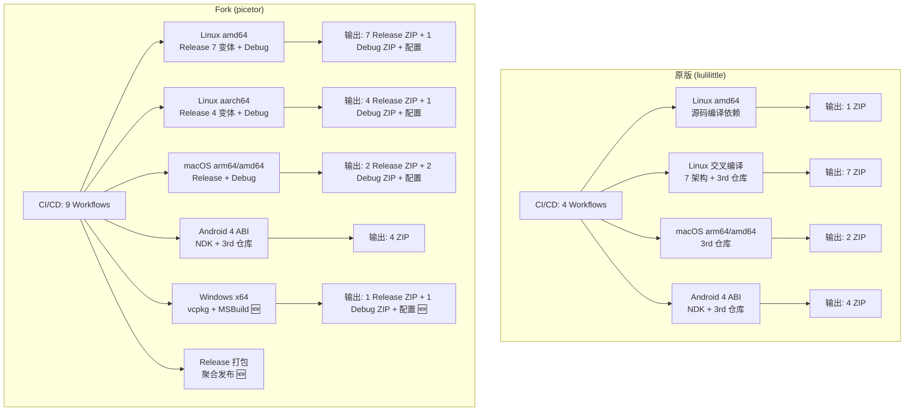
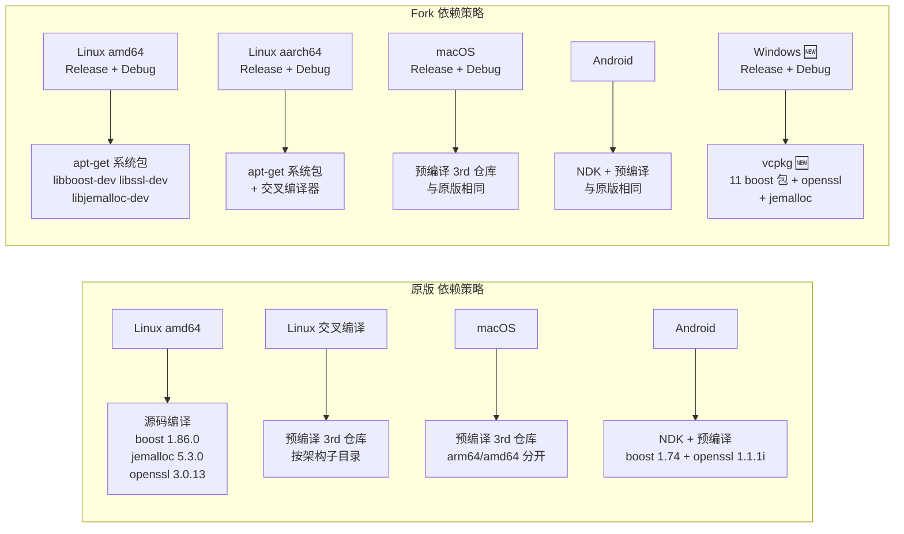

# PPP PRIVATE NETWORK™ 2 — 迭代文档：原版 (liulilittle) vs Fork (picetor)

> 生成日期：2026年
> 
> 原版仓库：`github.com/liulilittle/openppp2`
> 
> Fork 仓库：`github.com/picetor/openppp2`
>
> ## 分支说明
>
> | 分支 | 说明 |
> |------|------|
> | `master`（默认） | **Fork 主分支** — picetor/openppp2 的活跃开发分支，包含所有改进（Windows CI、构建脚本、文档等） |
> | `main` | **原版跟踪分支** — liulilittle/openppp2 的默认分支的本地副本，用于同步上游更新 |
> | `remotes/origin/main` | 远程 `origin` 的 `main` 分支 |
> | `remotes/origin/master` | 远程 `origin` 的 `master` 分支（即当前 `master` 的远程版本） |
> | `remotes/upstream/main` | 上游原版 `liulilittle/openppp2` 的 `main` 分支 |
>
> | 远程名 | 仓库 | 角色 |
> |--------|------|------|
> | `origin` | `github.com/picetor/openppp2` | **你的 Fork** |
> | `upstream` | `github.com/liulilittle/openppp2` | **原版上游** |

---

## 目录

1. [概述](#1-概述)
2. [CI/CD 工作流对比](#2-cicd-工作流对比)
3. [构建系统对比](#3-构建系统对比)
4. [构建变体对比](#4-构建变体对比)
5. [项目文件对比](#5-项目文件对比)
6. [配置对比](#6-配置对比)
7. [源码差异](#7-源码差异)
8. [文档差异](#8-文档差异)
9. [其他差异](#9-其他差异)
10. [迭代总结](#10-迭代总结)

---

## 1. 概述

| 维度 | 原版 (liulilittle) | Fork (picetor) |
|------|-------------------|----------------|
| 仓库所有者 | liulilittle | picetor |
| CI 平台 | GitHub Actions | GitHub Actions |
| 主要语言 | C++17 | C++17 |
| 构建系统 | CMake + Make (Linux/macOS/Android) + MSBuild (Windows) | CMake + Make (Linux/macOS/Android) + MSBuild (Windows) |
| 第三方依赖 | 源码编译 (boost/jemalloc/openssl) 或预编译 3rd 仓库 | vcpkg (Windows) + 系统包管理器 (Linux/macOS) |
| 目标平台 | Windows, Linux, macOS, Android | Windows, Linux, macOS, Android |
| 证书文件 | 仓库自带 `starrylink.net.key/.pem` + `cacert.pem` | 占位符创建 + 从 curl.se 下载 |

---

## 2. CI/CD 工作流对比

### 2.1 工作流数量与分工

| 原版 (liulilittle) | Fork (picetor) |
|---|---|
| **4 个 workflow 文件**，按平台+构建方式划分 | **9 个 workflow 文件**（4 Release + 4 Debug + 1 Release 打包），按平台独立拆分 |
| ① `build-openppp2-for-linux-using-ubuntu-latest.yml` — Linux amd64 单架构 | ① `build-openppp2-linux-amd64.yml` — Linux amd64 Release |
| ② `build-openppp2-for-linux-using-ubuntu-latest-cross.yml` — Linux 多架构交叉编译 (7 种架构) | ② `build-openppp2-linux-aarch64.yml` — Linux aarch64 Release |
| ③ `build-openppp2-for-darwin-using-macos-latest.yml` — macOS arm64 + amd64 | ③ `build-openppp2-darwin.yml` — macOS Release |
| ④ `build-openppp2-for-android-using-ubuntu-latest-cross.yml` — Android 4 种 ABI | ④ `build-openppp2-android.yml` — Android |
| — | **⑤ `build-openppp2-windows.yml`** — **Windows Release (新增！)** |
| — | **⑥ `build-openppp2-amd64-debug.yml`** — **Linux amd64 Debug (新增！)** |
| — | **⑦ `build-openppp2-aarch64-debug.yml`** — **Linux aarch64 Debug (新增！)** |
| — | **⑧ `build-openppp2-macos-debug.yml`** — **macOS Debug (新增！)** |
| — | **⑨ `build-openppp2-windows-debug.yml`** — **Windows Debug (新增！)** |

### 2.2 关键语法差异

| 特性 | 原版 (liulilittle) | Fork (picetor) |
|------|-------------------|----------------|
| actions/checkout | `git clone https://github.com/...` (手动克隆) | `uses: actions/checkout@v4` |
| upload-artifact 版本 | `@v4` | `@v7` |
| 环境变量设置 | `echo ::set-env name=VAR::value` (已废弃) | `echo "VAR=value" >> $GITHUB_ENV` |
| `ACTIONS_ALLOW_UNSECURE_COMMANDS` | `true` (兼容废弃语法) | 不存在 |
| Runner | `ubuntu-latest`, `macos-latest` | `ubuntu-24.04`, `macos-latest`, `windows-2025-vs2026` |
| 第三方依赖策略 | 源码编译 (boost/jemalloc/openssl) 或预编译 3rd 仓库 | vcpkg (Windows) + apt-get (Linux) + 预编译 3rd (macOS) |
| Debug/Release 分离 | 无 | **新增！** 4 个 Debug 工作流独立于 Release，Debug 支持 `push` 自动触发，Release 仅 `workflow_dispatch` |

### 2.3 原版 Linux 工作流 (非交叉编译)

```yaml
# 原版：单架构 amd64，源码编译所有依赖
steps:
  - git clone https://github.com/liulilittle/openppp2.git
  - apt-get install build-essential cmake gcc g++ ...
  - wget boost_1_86_0.tar.bz2 → ./bootstrap.sh → ./b2
  - wget jemalloc-5.3.0.tar.bz2 → ./autogen.sh → make
  - wget openssl-3.0.13.tar.gz → ./Configure → make
  - cmake .. -DCMAKE_BUILD_TYPE=Release
  - make -j $ncpu
  - zip -r openppp2-linux-amd64.zip ppp
  - upload-artifact@v4
```

### 2.4 Fork Linux 工作流

```yaml
# Fork：多变体构建，apt-get 安装依赖
steps:
  - uses: actions/checkout@v4
  - apt-get install libboost-dev libssl-dev libjemalloc-dev ...
  - 遍历 builds/ 目录中的 7 个 CMakeLists.txt 变体
    - 每个变体: cmake .. → make → zip
  - upload-artifact@v7
```

### 2.5 原版交叉编译工作流

- 支持 **7 种架构**：`amd64`, `aarch64`, `armv7l`, `ppc64el`, `s390x`, `riscv64`, `mipsel`
- 使用预编译 3rd 仓库 `openppp2-ubuntu-3rd-environment`，按架构子目录存放
- 通过 `sed -i` 替换 CMakeLists.txt 中的 `THIRD_PARTY_LIBRARY_DIR`
- 安装对应交叉编译器（如 `gcc-aarch64-linux-gnu`）

### 2.6 Fork 交叉编译

- Fork **移除了** 7 架构交叉编译工作流，仅保留 `amd64` 和 `aarch64`
- 但保留了 `build-openppp2-by-cross.sh` 脚本（与原版相同）
- 新增了 `build-openppp2-by-builds.sh` 脚本（原版没有）

### 2.7 原版 macOS 工作流

- 使用预编译 3rd 仓库：
  - `darwin/arm64` → `openppp2-macos-arm64-environment`
  - `darwin/amd64` → `openppp2-macos-amd64-environment`
- 通过 `sed -i ''` 替换 CMakeLists.txt 中的 `THIRD_PARTY_LIBRARY_DIR`
- 使用 `-DCMAKE_OSX_ARCHITECTURES=arm64/x86_64` 指定架构
- 使用 `-DCMAKE_POLICY_VERSION_MINIMUM=3.5` 兼容策略

### 2.8 Fork macOS 工作流

- 同样使用预编译 3rd 仓库（与原版相同）
- 同样使用 `CMAKE_OSX_ARCHITECTURES` 和 `CMAKE_POLICY_VERSION_MINIMUM`
- 输出为 ZIP 包，包含 `ppp` 二进制 + 4 个配置文件

### 2.9 原版 Android 工作流

- 使用 NDK r20b（从 dl.google.com 下载）
- 使用 boost 1.74 for Android（`boost-1.74-for-android-r20b-fpic`）
- 使用 openssl 1.1.1i for Android（`openssl-1.1.1i-for-android-r20b`）
- 支持 4 种 ABI：`arm64-v8a`, `armeabi-v7a`, `x86`, `x86_64`
- 编译输出 `libopenppp2.so` 动态库
- 使用 `android/CMakeLists.txt`（独立于根目录 CMakeLists.txt）

### 2.10 Fork Android 工作流

- 同样使用 NDK + boost + openssl for Android
- 同样支持 4 种 ABI
- 同样输出 `libopenppp2.so`

### 2.11 Windows 工作流（Fork 独有）

**原版没有 Windows CI！** Fork 新增了完整的 Windows 构建工作流：

- **Runner**: `windows-2025-vs2026`
- **依赖管理**: vcpkg（而非源码编译）
- **vcpkg 安装包**:
  - `boost-asio`, `boost-beast`, `boost-json`, `boost-program-options`
  - `boost-system`, `boost-thread`, `boost-lockfree`, `boost-uuid`
  - `boost-coroutine`, `boost-filesystem`, `boost-stacktrace`
  - `openssl`, `jemalloc`
- **构建工具**: MSBuild（而非 CMake）
- **vcpkg 安装路径**: `--x-install-root=${{ github.workspace }}\..\vcpkg_installed`
- **Header 复制**: 从 `vcpkg/packages/` 复制到 `vcpkg_installed/`（解决 boost headers 路径问题）
- **构建命令**: `MSBuild ppp.vcxproj /p:Configuration=Release /p:Platform=x64 /p:VcpkgEnableManifest=false`

---

## 3. 构建系统对比

### 3.1 CMakeLists.txt 差异

| 特性 | 原版 | Fork |
|------|------|------|
| `THIRD_PARTY_LIBRARY_DIR` | 硬编码 `/root/dev`，CI 中通过 `sed -i` 替换 | 同样硬编码 `/root/dev`，同样通过 `sed -i` 替换 |
| 第三方库包含 | boost + jemalloc + openssl（+ 可选 liburing/curl） | 与原版相同 |
| 链接库 (Linux) | `libboost_system`, `libboost_coroutine`, `libboost_thread`, `libboost_context`, `libboost_regex`, `libboost_filesystem` | 与原版相同 |
| 链接库 (macOS) | 同上，使用绝对路径 `${THIRD_PARTY_LIBRARY_DIR}/...` | 与原版相同 |
| 链接库 (Clang) | 使用 `lib*.a` 名称 | 与原版相同 |
| AES-NI SIMD | 可选，通过 `__SIMD__` 宏控制 | 与原版相同 |
| io_uring | 可选，通过 `BOOST_ASIO_HAS_IO_URING` 控制 | 与原版相同 |
| 静态链接 | `-static-libstdc++ -rdynamic -Wl,-Bstatic` | 与原版相同 |

### 3.2 builds/ 目录变体（完全相同）

Fork 完全保留了原版的 7 个构建变体：

| 变体 | SYSNAT | io_uring | SIMD (AES-NI) |
|------|--------|----------|---------------|
| `openppp2-linux-amd64-io-uring` | ❌ | ✅ | ❌ |
| `openppp2-linux-amd64-io-uring-simd` | ❌ | ✅ | ✅ |
| `openppp2-linux-amd64-simd` | ❌ | ❌ | ✅ |
| `openppp2-linux-amd64-tc` | ✅ | ❌ | ❌ |
| `openppp2-linux-amd64-tc-io-uring` | ✅ | ✅ | ❌ |
| `openppp2-linux-amd64-tc-io-uring-simd` | ✅ | ✅ | ✅ |
| `openppp2-linux-amd64-tc-simd` | ✅ | ❌ | ✅ |

> **注**: `tc` = 透明代理/系统 NAT 模式，`io_uring` = Linux 异步 I/O 后端，`simd` = AES-NI 硬件加速

### 3.3 构建脚本

| 脚本 | 原版 | Fork |
|------|------|------|
| `build-openppp2-by-cross.sh` | ✅ 交叉编译脚本，支持 7 种架构 | ✅ 与原版相同 |
| `build-openppp2-by-builds.sh` | ❌ **不存在** | ✅ **新增！** 遍历 builds/ 目录所有变体进行批量构建 |
| `build-all.sh` | ❌ **不存在** | ✅ **新增！** 一键构建脚本 |

### 3.4 ppp.vcxproj 差异

| 特性 | 原版 | Fork |
|------|------|------|
| WindowsTargetPlatformVersion | `10.0.19041.0` | 相同 |
| PlatformToolset | `v143` (VS 2022) | 相同 |
| VcpkgEnableManifest | `false` | 相同 |
| VcpkgUseStatic | `true` | 相同 |
| IncludePath | 不含 vcpkg 路径 | **新增** `$(ProjectDir)..\vcpkg_installed\x64-windows-static\include` |
| LibraryPath | 不含 vcpkg 路径 | **新增** `$(ProjectDir)..\vcpkg_installed\x64-windows-static\lib` |
| 预处理器定义 | `WIN32;_DEBUG;NDEBUG;JEMALLOC;BUDDY_ALLOC_IMPLEMENTATION;__SIMD__;FUNCTION;...` | 与原版相同 |
| 语言标准 | `stdcpp17` | 相同 |
| 指令集 | `AdvancedVectorExtensions` (AVX) | 相同 |
| 运行时库 | Debug: `MultiThreadedDebug`, Release: `MultiThreaded` | 相同 |
| UAC 执行级别 | `RequireAdministrator` | 相同 |

---

## 4. 构建变体对比

### 4.1 Linux amd64

| 特性 | 原版 | Fork |
|------|------|------|
| 变体数量 | 7 个 (builds/ 目录) | 7 个 (builds/ 目录，完全相同) |
| CI 构建方式 | 单次 cmake + make | 遍历 builds/ 所有变体 |
| 输出格式 | `openppp2-linux-amd64.zip` | `openppp2-linux-amd64-{variant}.zip` |
| 额外文件 | 仅二进制 | 二进制 + 4 配置文件 |

### 4.2 Linux aarch64

| 特性 | 原版 | Fork |
|------|------|------|
| 构建方式 | 交叉编译 (gcc-aarch64-linux-gnu) | 交叉编译 |
| 变体数量 | 1 (默认 CMakeLists.txt) | 4 (builds/ 目录子集) |
| 输出 | `openppp2-linux-aarch64.zip` | `openppp2-linux-aarch64-{variant}.zip` |

### 4.3 macOS

| 特性 | 原版 | Fork |
|------|------|------|
| 架构 | arm64 + amd64 | arm64 + amd64 |
| 3rd 仓库 | 与原版相同 | 与原版相同 |
| 输出 | `openppp2-darwin-arm64.zip`, `openppp2-darwin-amd64.zip` | 相同，但包含配置文件 |

### 4.4 Windows（Fork 独有）

| 特性 | Fork |
|------|------|
| 架构 | x64 |
| 构建工具 | MSBuild |
| 依赖 | vcpkg |
| 输出 | `openppp2-windows-x64.zip` |
| 包含文件 | `ppp.exe` + `appsettings.json` + `starrylink.net.key` + `starrylink.net.pem` + `cacert.pem` |

---

## 5. 项目文件对比

### 5.1 根目录文件

| 文件 | 原版 | Fork | 说明 |
|------|------|------|------|
| `README.md` | ✅ 英文 | ✅ 英文 | Fork 内容相同 |
| `README_CN.md` | ✅ 中文 | ✅ 中文 | Fork 内容相同 |
| `README_EN.md` | ❌ | ✅ **新增** | Fork 新增的英文 README |
| `CMakeLists.txt` | ✅ | ✅ | 基本相同 |
| `main.cpp` | ✅ | ✅ | 基本相同 |
| `appsettings.json` | ✅ | ✅ | 结构相同，IP 地址不同 |
| `ppp.vcxproj` | ✅ | ✅ | Fork 新增 vcpkg 路径 |
| `ppp.sln` | ✅ | ✅ | 相同 |
| `LICENSE` | ✅ | ✅ | 相同 |
| `cacert.pem` | ✅ 仓库自带 | ❌ CI 中下载 | Fork 从 curl.se 下载 |
| `cacert.sha256` | ❌ | ✅ **新增** | 证书校验 |
| `starrylink.net.key` | ✅ 仓库自带 | ✅ 占位符创建 | Fork 不包含真实证书 |
| `starrylink.net.pem` | ✅ 仓库自带 | ✅ 占位符创建 | Fork 不包含真实证书 |
| `环境需求.md` | ❌ | ✅ **新增** | 中文环境需求文档 |
| `WSS修改版环境需求.md` | ❌ | ✅ **新增** | WSS 修改版环境需求 |
| `releases环境需求清单.md` | ❌ | ✅ **新增** | Release 环境需求清单 |
| `glibc_compat.h` | ❌ | ✅ **新增** | glibc 兼容性头文件 |

### 5.2 目录结构差异

| 目录 | 原版 | Fork | 说明 |
|------|------|------|------|
| `.github/workflows/` | 4 个文件 | 9 个文件 | Fork 新增 Windows 工作流 + 4 个 Debug 工作流 + Release 打包工作流 |
| `builds/` | 7 个变体 | 7 个变体 + `6.22/` + `6.23/` + `存档/` + `releases/` | Fork 新增版本目录和存档 |
| `sln/` | client/server/PaperAirplane/sysproxy32 | 相同 | 相同 |
| `go/` | main.go + ppp/ + auxiliary/ + io/ | 相同 | 相同 |
| `docs/` | 4 个文件 (TRANSMISSION) | 4 个文件 + **新增** `TRANSMISSION_CN.md` 等 | Fork 新增中文翻译 |
| `build-release-amd64/` | ❌ | ✅ **新增** | 本地构建输出目录 |
| `Release/` | ❌ | ✅ **新增** | Release 输出目录 |
| `x64/` | ❌ | ✅ **新增** | Windows x64 输出目录 |
| `vcpkg/` | ❌ | ✅ **新增** | vcpkg 包管理器 |

---

## 6. 配置对比

### 6.1 appsettings.json

两版的 `appsettings.json` 结构完全相同，仅 IP 地址等具体值不同：

```json
{
    "concurrent": 1,
    "cdn": [80, 443],
    "key": { "kf": 154543927, "kx": 128, "kl": 10, "kh": 12, "sb": 1000,
             "protocol": "aes-128-cfb", "protocol-key": "...",
             "transport": "aes-256-cfb", "transport-key": "...",
             "masked": false, "plaintext": false,
             "delta-encode": false, "shuffle-data": false },
    "ip": { "public": "...", "interface": "..." },
    "vmem": { "size": 4096, "path": "./{}" },
    "tcp": { "inactive": { "timeout": 300 }, "connect": { "timeout": 5, "nexcept": 4 },
             "listen": { "port": 20000 }, "cwnd": 0, "rwnd": 0, "turbo": true,
             "backlog": 511, "fast-open": true },
    "udp": { "cwnd": 0, "rwnd": 0, "inactive": { "timeout": 72 },
             "dns": { "timeout": 4, "ttl": 60, "cache": true, "turbo": false, "redirect": "0.0.0.0" },
             "listen": { "port": 20000 },
             "static": { "keep-alived": [20, 60], "dns": true, "quic": true, "icmp": true,
                         "aggligator": 4, "servers": ["1.0.0.1:20000", ...] } },
    "mux": { "connect": { "timeout": 20 }, "inactive": { "timeout": 60 },
             "congestions": 134217728, "keep-alived": [5, 20] },
    "websocket": { "host": "starrylink.net", "path": "/tun",
                   "listen": { "ws": 20080, "wss": 20443 },
                   "ssl": { "certificate-file": "starrylink.net.pem", ... },
                   "verify-peer": true, "http": { ... } },
    "server": { "log": "./ppp.log", "node": 1, "subnet": true, "mapping": true,
                "backend": "ws://.../ppp/webhook", "backend-key": "..." },
    "client": { "guid": "{...}", "server": "ppp://...:20000/",
                "bandwidth": 10000, "http-proxy": { ... }, "socks-proxy": { ... },
                "mappings": [...], "routes": [...] }
}
```

---

## 7. 源码差异

### 7.1 ppp/stdafx.h

两版基本相同，关键包含：

```cpp
// 两版都包含：
#include <boost/beast/core/detail/config.hpp>  // 自定义 BOOST_BEAST_VERSION
#include <boost/asio.hpp>
#include <boost/asio/spawn.hpp>
#include <boost/beast/core.hpp>
#include <boost/beast/websocket.hpp>
#include <boost/beast/http.hpp>
#include <boost/asio/ssl.hpp>
#include <boost/beast/ssl.hpp>
#include <boost/lockfree/queue.hpp>
#include <boost/lockfree/stack.hpp>
#include <boost/uuid/uuid.hpp>
#include <boost/uuid/uuid_generators.hpp>
#include <boost/uuid/uuid_io.hpp>
```

### 7.2 ppp/stdafx.cpp

两版都包含 `#include <boost/stacktrace.hpp>`。

### 7.3 ppp/io/File.cpp

两版都包含 `#include <boost/filesystem.hpp>`。

### 7.4 main.cpp

两版结构相同，包含：
- 相同的头文件引用
- 相同的 `NetworkInterface` 结构体
- 相同的 `ConsoleForegroundWindowSize` 和 `PrintToConsoleForegroundWindow`
- 相同的配置加载、网络初始化、TAP 设备管理逻辑

### 7.5 android/libopenppp2.cpp

两版结构相同，JNI 接口层代码一致。

### 7.6 日志系统增强（Fork 独有）

Fork 新增了 **运行时详细日志（Runtime Verbose Logging）** 机制，用于诊断网络连接问题：

#### 7.6.1 编译开关控制

在 `ppp/stdafx.h` 中新增 `PPP_LOG_VERBOSE` 编译开关：

```cpp
#if defined(PPP_LOG_VERBOSE)
#define LOG_DEBUG(...)     do { fprintf(stdout, "[%s][%s:%d] ", GetCurrentTimeString().data(), __FILE__, __LINE__), fprintf(stdout, __VA_ARGS__), fprintf(stdout, "\n"); } while (0)
#else
#define LOG_DEBUG(...)     ((void)0)
#endif
```

- `LOG_INFO` / `LOG_ERROR` / `LOG_WARN` — 始终编译，Release 和 Debug 配置都有
- `LOG_DEBUG` — **只有定义了 `PPP_LOG_VERBOSE` 才编译**，默认关闭，零性能开销

#### 7.6.2 已添加 LOG_DEBUG 的模块

| 文件 | LOG_DEBUG 调用数 | 关键日志点 |
|------|----------------|-----------|
| `windows/ppp/tap/TapWindows.cpp` | 18 | TAP 设备创建、驱动打开、发送/接收数据包循环 |
| `ppp/app/client/VEthernetExchanger.cpp` | 39 | 连接过程、重连循环、MUX 事件、Echo 保活 |
| `ppp/app/mux/vmux_net.cpp` | 30 | mux 销毁、底层发送、空闲释放、心跳、握手 |
| `ppp/app/client/VEthernetNetworkSwitcher.cpp` | 16 | 客户端 Open() 各步骤（网卡、TAP、exchanger、HTTP/SOCKS 代理） |
| `ppp/net/asio/vdns.cpp` | 10 | DNS 解析请求发送、响应接收、完成/超时、缓存命中 |
| `ppp/transmissions/ITransmission.cpp` | 16 | 客户端/服务端握手、加密/解密 |
| `ppp/transmissions/ITcpipTransmission.cpp` | 5 | TCP 读写字节 |
| `ppp/transmissions/IWebsocketTransmission.cpp` | 2 | WebSocket/SSL 握手 |
| `ppp/app/protocol/VirtualEthernetTcpipConnection.cpp` | 28 | MuxOrConnect、MuxOrAccept、Run、ForwardTransmissionToSocket |
| `ppp/app/server/VirtualEthernetSwitcher.cpp` | 16 | 服务端监听器创建、接受连接、握手流程 |
| `linux/ppp/tap/TapLinux.cpp` | 5 | Linux TUN/TAP 设备数据包发送、流读取错误 |
| `ppp/transmissions/templates/WebSocket.h` | 6 | WebSocket 读写字节（已销毁、读取失败、写入失败） |
| `ppp/app/protocol/VirtualEthernetLinklayer.cpp` | 9 | 链路层数据循环、PacketInput、保活超时 |

#### 7.6.3 使用方法

在 `ppp.vcxproj` 的 `PreprocessorDefinitions` 中添加 `PPP_LOG_VERBOSE`，或在编译命令行加 `/DPPP_LOG_VERBOSE`。运行后 LOG_DEBUG 输出到 stdout（控制台），格式：

```
[2026-06-25 12:00:00.000][file.cpp:123] message
```

#### 7.6.4 `--log-file` 运行时重定向（Fork 独有）

Fork 新增了 `--log-file <path>` 命令行参数，用于将 LOG_DEBUG 输出重定向到文件而非控制台：

- **全局变量**：`std::string LOG_FILE_PATH_`（定义在 `main.cpp`）
- **解析位置**：`PreparedArgumentEnvironment()` 中解析 `--log-file` 参数
- **重定向机制**：在 `main()` 中，`PreparedArgumentEnvironment()` 之后，通过 `#if defined(PPP_LOG_VERBOSE)` 守卫，调用 `freopen(path, "a", stdout)` 将 stdout 重定向到指定文件
- **控制台保留**：`PrintEnvironmentInformation()` 使用 `fprintf(stderr, ...)` 输出面板信息，确保控制台显示不受影响
- **仅 Debug 版本**：`--log-file` 仅在定义了 `PPP_LOG_VERBOSE` 的 Debug 构建中生效，Release 版本忽略此参数

使用示例：
```bash
# Debug 版本：日志写入文件，控制台仍显示面板
./ppp --log-file /var/log/ppp-debug.log
```

#### 7.6.5 Debug 构建配置（Fork 独有）

Fork 新增了 Debug 构建配置，用于启用 LOG_DEBUG 日志：

**CMakeLists.txt（Linux/macOS）：**
```cmake
# Debug 配置自动添加 -DPPP_LOG_VERBOSE
IF(CMAKE_BUILD_TYPE STREQUAL "Debug")
    SET(CMAKE_CXX_FLAGS_DEBUG "${CMAKE_CXX_FLAGS_DEBUG} -DPPP_LOG_VERBOSE")
ENDIF()
```

**ppp.vcxproj（Windows）：**
```xml
<!-- Debug|x64 配置包含 PPP_LOG_VERBOSE -->
<PreprocessorDefinitions>...;PPP_LOG_VERBOSE;%(PreprocessorDefinitions)</PreprocessorDefinitions>
```

**Debug 构建变体（`builds/debug/` 目录 + CI 自动构建）：**

本地编译使用 `builds/debug/` 目录下的 CMakeLists.txt 变体：
| 变体 | 平台 | 架构 |
|------|------|------|
| `openppp2-linux-amd64` | Linux | amd64 |
| `openppp2-linux-aarch64` | Linux | aarch64 |
| `openppp2-darwin-amd64` | macOS | amd64 |
| `openppp2-darwin-aarch64` | macOS | arm64 |

所有 Debug 变体均设置 `PLATFORM_DEBUG=TRUE` 和 `-DPPP_LOG_VERBOSE`。

**CI 自动构建：** Debug 与 Release 工作流已分离为独立文件，各自独立触发和运行：

| CI 工作流 | Debug 产物名 | 触发方式 |
|-----------|-------------|---------|
| `build-openppp2-amd64-debug.yml` | `openppp2-linux-amd64-debug` | `push` 到 master（代码变更自动触发）+ `workflow_dispatch` |
| `build-openppp2-aarch64-debug.yml` | `openppp2-linux-aarch64-debug` | `push` 到 master（代码变更自动触发）+ `workflow_dispatch` |
| `build-openppp2-macos-debug.yml` | `openppp2-darwin-arm64-debug` + `openppp2-darwin-amd64-debug` | `push` 到 master（代码变更自动触发）+ `workflow_dispatch` |
| `build-openppp2-windows-debug.yml` | `openppp2-windows-x64-debug` | `push` 到 master（代码变更自动触发）+ `workflow_dispatch` |

> **注意**：Release 工作流仅支持 `workflow_dispatch` 手动触发，Debug 工作流额外支持 `push` 自动触发，方便开发调试。

#### 7.6.6 跨平台支持

| 平台 | LOG_DEBUG 支持 | --log-file 支持 | 构建方式 |
|------|---------------|----------------|---------|
| Linux amd64 | ✅ | ✅ | CMake + Make，Debug 配置 |
| Linux aarch64 | ✅ | ✅ | CMake + 交叉编译，Debug 配置 |
| macOS amd64 | ✅ | ✅ | CMake + Make，Debug 配置 |
| macOS arm64 | ✅ | ✅ | CMake + Make，Debug 配置 |
| Windows x64 | ✅ | ✅ | MSBuild + vcpkg，Debug 配置 |
| Linux TAP (amd64) | ✅ | ✅ | CMake + Make，Debug 配置（`linux/ppp/tap/TapLinux.cpp`） |
| Linux TAP (aarch64) | ✅ | ✅ | CMake + 交叉编译，Debug 配置（`linux/ppp/tap/TapLinux.cpp`） |

#### 7.6.7 设计意图

原版没有任何运行时详细日志机制，排查网络问题只能靠 `printf` 临时加日志。Fork 的日志系统设计目标：

- **按需开启**：编译开关控制，Debug 构建默认开启，Release 版本关闭
- **全路径覆盖**：从 TAP 设备 → DNS 解析 → 握手 → 加密 → 数据转发，覆盖完整数据流
- **低侵入**：LOG_DEBUG 默认编译为空，不影响性能
- **诊断导向**：专门为"Windows 版本连不上网"这类问题设计，每个日志点都包含关键上下文（hostname、端口、状态码等）
- **文件输出**：通过 `--log-file` 参数将详细日志写入文件，避免干扰控制台面板显示
- **跨平台一致**：Linux、macOS、Windows 三平台均支持 Debug 构建和日志重定向

---

## 8. 文档差异

| 文档 | 原版 | Fork |
|------|------|------|
| `README.md` | 英文，功能列表 + 平台支持 + 许可协议 | 相同 |
| `README_CN.md` | 中文，同上 | 相同 |
| `README_EN.md` | ❌ | ✅ **新增** |
| `docs/TRANSMISSION.md` | ✅ 英文传输协议文档 | ✅ 相同 |
| `docs/TRANSMISSION_CN.md` | ✅ 中文传输协议文档 | ✅ 相同 |
| `docs/TRANSMISSION_PACK_SESSIONID.md` | ✅ 英文 | ✅ 相同 |
| `docs/TRANSMISSION_PACK_SESSIONID_CN.md` | ✅ 中文 | ✅ 相同 |
| `环境需求.md` | ❌ | ✅ **新增** 中文环境需求 |
| `WSS修改版环境需求.md` | ❌ | ✅ **新增** WSS 修改版需求 |
| `releases环境需求清单.md` | ❌ | ✅ **新增** Release 清单 |

---

## 9. 其他差异

### 9.1 证书文件处理

| 文件 | 原版 | Fork |
|------|------|------|
| `starrylink.net.key` | 仓库中真实文件 | CI 中 `echo "placeholder" >` 创建 |
| `starrylink.net.pem` | 仓库中真实文件 | CI 中 `echo "placeholder" >` 创建 |
| `cacert.pem` | 仓库中真实文件 | CI 中 `curl -L https://curl.se/ca/cacert.pem` 下载 |

### 9.2 输出产物

| 平台 | 原版 | Fork |
|------|------|------|
| Linux amd64 | `openppp2-linux-amd64.zip` (仅二进制) | `openppp2-linux-amd64-{variant}.zip` (二进制 + 配置) |
| Linux aarch64 | `openppp2-linux-aarch64.zip` | `openppp2-linux-aarch64-{variant}.zip` |
| macOS | `openppp2-darwin-{arch}.zip` (仅二进制) | `openppp2-darwin-{arch}.zip` (二进制 + 配置) |
| Windows | ❌ | `openppp2-windows-x64.zip` (exe + 配置) |
| Android | `openppp2-android-{abi}.zip` (libopenppp2.so) | 相同 |

### 9.3 Release 管理

Fork 在 `builds/` 目录下新增了：
- `builds/6.22/` — 版本 6.22 的构建配置
- `builds/6.23/` — 版本 6.23 的构建配置
- `builds/存档/` — 历史构建配置存档
- `builds/releases/` — Release 输出目录

---

## 10. 迭代总结

### 10.1 Fork 的主要改进

| # | 改进 | 说明 |
|---|------|------|
| 1 | **新增 Windows CI/CD** | 原版完全没有 Windows 持续集成，Fork 使用 vcpkg + MSBuild 实现了完整的 Windows 构建流水线 |
| 2 | **工作流现代化** | 废弃语法 `::set-env` → `$GITHUB_ENV`，`git clone` → `actions/checkout@v4`，`@v4` → `@v7` |
| 3 | **工作流拆分** | 从 4 个文件拆分为 9 个（4 Release + 4 Debug + 1 Release 打包），按平台独立管理，职责更清晰 |
| 4 | **Debug/Release 工作流分离** | Debug 与 Release 拆分为独立文件，Debug 支持 `push` 自动触发，Release 仅 `workflow_dispatch`，大幅缩短 Release 编译等待时间 |
| 5 | **多配置输出** | Linux 构建输出 7 个变体 ZIP，每个包含配置文件和证书 |
| 6 | **新增构建脚本** | `build-openppp2-by-builds.sh` 批量构建所有变体 |
| 7 | **新增文档** | 环境需求、Release 清单等中文文档 |
| 8 | **证书动态获取** | cacert.pem 从 curl.se 实时下载，确保证书最新 |
| 9 | **vcpkg 集成** | Windows 使用 vcpkg 管理第三方依赖，替代手动编译 |
| 10 | **运行时详细日志系统** | 新增 `PPP_LOG_VERBOSE` 编译开关控制 LOG_DEBUG，覆盖 TAP 设备、DNS 解析、握手、加密、数据转发等全路径，用于诊断网络连接问题 |

### 10.2 原版保留的特性

| # | 特性 | 说明 |
|---|------|------|
| 1 | **核心源码** | `ppp/`, `common/`, `main.cpp` 等核心代码完全保留 |
| 2 | **构建变体** | 7 个 builds/ 变体完全保留 |
| 3 | **CMakeLists.txt** | 构建系统配置完全保留 |
| 4 | **Android 构建** | NDK + boost + openssl for Android 方式完全保留 |
| 5 | **macOS 构建** | 预编译 3rd 仓库方式完全保留 |
| 6 | **交叉编译脚本** | `build-openppp2-by-cross.sh` 完全保留 |
| 7 | **appsettings.json** | 配置结构完全保留 |
| 8 | **sln/ 解决方案** | client/server/PaperAirplane/sysproxy32 完全保留 |
| 9 | **Go 实现** | `go/` 目录完全保留 |
| 10 | **传输协议文档** | `docs/` 传输协议文档完全保留 |

### 10.3 架构对比图



### 10.4 依赖管理对比



### 10.5 待改进项

| # | 建议改进 | 优先级 |
|---|---------|--------|
| 1 | **Windows 构建稳定性** — 当前 Windows 构建仍有 boost 头文件路径问题，需确保 vcpkg 安装后 headers 正确复制到 `vcpkg_installed/` | **高** |
| 2 | **Linux 交叉编译恢复** — 原版支持 7 架构交叉编译，Fork 仅保留 amd64 + aarch64，可考虑恢复 | 中 |
| 3 | **vcpkg manifest 模式** — 当前使用 `VcpkgEnableManifest=false` + 手动安装，可迁移到 `vcpkg.json` manifest 模式 | 中 |
| 4 | **统一构建脚本** — `build-openppp2-by-builds.sh` 和 `build-openppp2-by-cross.sh` 可整合 | 低 |
| 5 | **Release 自动化** — 可考虑添加自动 Release 发布工作流 | 低 |
| 6 | **Debug 工作流产物保留** — 当前 Debug 产物仅作为 CI artifact 保留，可考虑自动上传到 Release 的 prerelease | 低 |
